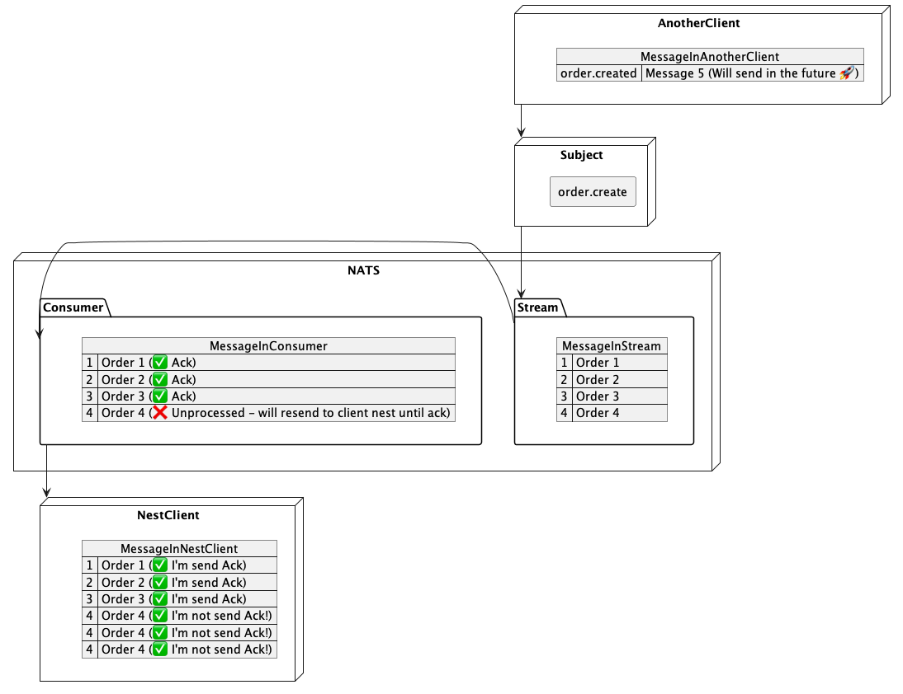

# Nest Jetstream Demo

## Ilustrasi



Stream menerima message dari AnotherClient, sebagai contoh Stream menerima 4 order, kebetulan stream tersebut mempunyai consumer. Dan consumer mempunyai NestClient (yang menkonsumsi message)

NestClient menerima order 1, order 2, order 3 dan mengirim balikan ack, sehingga consumer mengetahui bahwa message berhasil di kirim, namun pada order 4 NestClient tidak mengirim balikan Ack, sehingga Consumer akan terus menerus mengirim ulang Order 4, sampai dia mendapatkan Ack atau mencapai limit nya

## Konfigurasi Stream
| Options | Description |
|---|---|
| name | string - Nama dari stream|
| subjects | string[] - Nama subject yang nantinya message akan di ambil oleh stream.
| num_replicas | Berapa banyak replicas untuk menyimpan setiap message di cluster JetStream, max 5 |
| discard | Ketika stream mencapai limit DiscardNew akan menolak message baru, DiscardOld menghapus message lama. |
| duplicate_window | untuk melacak message yang duplikat dalam (ns) |
| max_age | Max umur message di stream (ns) |
| max_msg_size | Ukuran terbesar message yang di perbolehkan oleh stream. |
| max_msgs | Berapa banyak jumlah message yang mungkin di simpan di stream, jika sudah melebihi jumlah message yang di tentukan akan menghapus message lama atau me-reject message baru. |
| max_msgs_per_subject | Jumlah maksimal msg per subject. |
| retention | Bagaimana retention di consider LimitsPolicy(default), InterestPolicy, WorkQueuePolicy. |
| storage | Tipe penyimpanan, File atau Memori </br> - Jika disimpan di memory, saat server mati maka stream akan hilang. </br> - Jika di simpan di File, saat server mati maka stream tidak akan hilang begitu pula consumer, dan msg nya. |

## Konfigurasi Consumer
| Options | Description |
|---|---|
| manualAck | Tiap - tiap message harus di acknowledged secara manual (bisa di lihat contoh di controller) |
| maxAckPending | number (default: 1024) </br> Jumlah maksimal message akan di terima tanpa mengirim balik ACK
| ackWait| (30s default) </br> Waktu dalam nanoseconds yang mana server akan menunggu ack untuk tiap - tiap message. Jika tidak di acknowledge maka akan di kirim ulang tiap 30 detik |
| ackPolicy | ackPolicy: Explicit, All, None (default: Excplicit ) </br> - Explicit tiap individual message harus di acknowledge. </br> - All hanya perlu menandai message terakhir saja, otomatis msg sebelumnya menjadi ack </br> - None tidak perlu men ack message apapun, server akan mengasumsi bahwa ack saat delivery. |
| deliverPolicy | deliverPolicy: All, Last, New, ByStartSequence, ByStartTime, last_per_subject (default: All) - Menspesifikasikan darimana stream akan mulai mengirim message </br> - All(Default) Consumer akan menerima message dari awal message diterima. </br> - Last Ketika pertama kali consume message. Consumer akan memulai menerima message dengan message yang terakhir di terima stream. </br> - New Ketika pertama kali consume message, consumer hanya akan memulai menerima message yang sudah dibuat setelah consumer telah dibuat. </br> - ByStartSequence Ketika pertama kali menerima message, dimulai dari set message tertentu, consumer harus menentukan startSequence, urutan sequence tertentu untuk consumer mulai consume. </br> - ByStartTime Ketika pertama kali consume message, message mulai diterima pada atau setelah waktu ini. </br> - last_per_subject Ketika pertama kali consume message, dimulai dengan yang terbaru untuk tiap tiap subject yang di filter saat ini di dalam stream.
| maxDeliver | Jumlah maksimal berapa kali tiap message bisa di deliver, applies ke message yang di kirim ulang karna issue ack policy. |
| maxMessages |  Jumlah max message yang bisa ada di consumer. |
| limit | membatasi delivery message dari stream ke consumer, dalam bit/s. |
| replayPolicy | replayPolicy:  Instant, All, ByStartSequence,  ByStartTime,  Original (default: Instant) </br> - Replay policy akan berlaku jika deliverPolicy All </br> - ByStartSequence or ByStartTime mulai membaca stream pada posisi tertentu selain dari akhir </br> - Original message di dalam stream akan di push ke client pada rate yang sama ketika original di terima. </br> - Instant (default), message akan dikirim secepat mungkin, ketika mematuhi AckPolicy, MaxAckPending and dan kemampuan client untuk menkonsumsi semua message. |
| description | Deskripsi text. |
| headersOnly | boolean - Konfigurasi consumer untuk hanya mengirim existing header dan Nats-Msg-Siz tanpa body |
| sample | number - Set persentasi acknowledgements yang harus di sample untuk observability, 0-100. |


## 1. Install Nats
[Installing Nats Server](https://docs.nats.io/running-a-nats-service/introduction/installation)

## 2. Jalankan Jetstream
```
# Jalankang server JetStream
nats-server -js -m 8222

# Check JetStream 
nats account info
```

## 3. Jalankan Aplikasi
```
yarn start:dev
nats stream ls
nats stream info mystream
nats stream view mystream
```

## 4. Test Aplikasi
### Create Order
```
curl http://localhost:3000/create
nats consumer sub mystream myservice-durable-order_created
```
### Update Order
```
curl http://localhost:3000/updated
nats consumer sub mystream myservice-durable-order_updated
```
### Delete Order
```
curl localhost:3000/updated
nats consumer sub mystream myservice-durable-order_deleted
```

### Show Report Stream
```
nats stream report
```

### Show Report Consumer
```
nats consumer report mystream
```